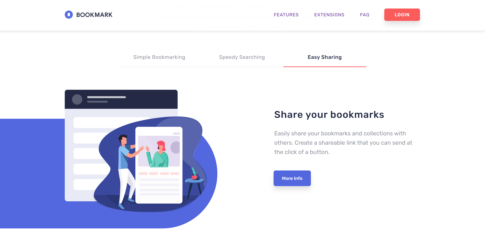

<h1 align='center'>Bookmark</h1>

  <h3>
    <a href="https://bookmark-nm.netlify.app/" target="_blank" color="white">
      Live Link
    </a>
  </h3>

   This is a landing page for a fictional web application called 'Bookmark'. It is also a challenge from Frontend Mentor. I've included an accordion, an interesting tabbed layout, and toast for a more dynamic user experience.

 
 

</img>

 
 

## 💡 Technologies:

   

 

- ThemeProvider
- Responsive Design
- React Hot Toast
- <a href="https://react-hot-toast.com/" color="white">
      React Hot Toast
    </a>
- <a href="https://www.framer.com/motion/" color="white">
      Framer Motion
    </a>

## 📄 Description

This is another challenge from front end mentor. You can learn more about this challenge here:

https://www.frontendmentor.io/challenges/bookmark-landing-page-5d0b588a9edda32581d29158

 

## 📷 Screenshots

### Features

 
 

### Extensions

 
 

### Faq

 
 

### CTA & Footer

 
 

### Hero (mobile)

 
 

## Questions and Feedback:

Feel free to contact me at mully7773@gmail.com if you have any questions or feedback.  
You can view more of my projects at https://github.com/Mully7773.
